# Multi-person Chat 2.0 流程圖與耦合分析

這份文件聚焦 3 件事：

1. 功能是被什麼事件觸發的
2. 功能之間如何串接
3. 哪些模組之間有明顯耦合

---

## 1. 系統總覽

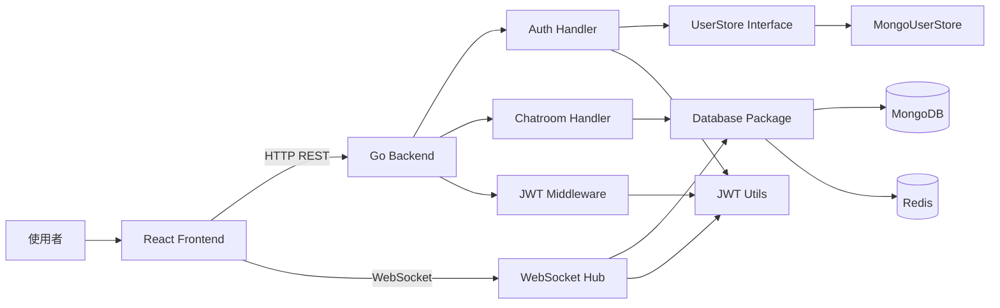

### 核心結論

- 前端是 `REST 初始化 + WebSocket 增量同步` 的混合模式。
- 後端以 `handlers` 處理 HTTP，以 `websocket.GlobalHub` 處理即時事件。
- MongoDB 負責持久化使用者、聊天室、訊息。
- Redis 只快取「某使用者的聊天室列表」。
- JWT 驗證同時影響 REST 與 WebSocket，兩邊都依賴 cookie `token`。

---

## 2. 前端主流程

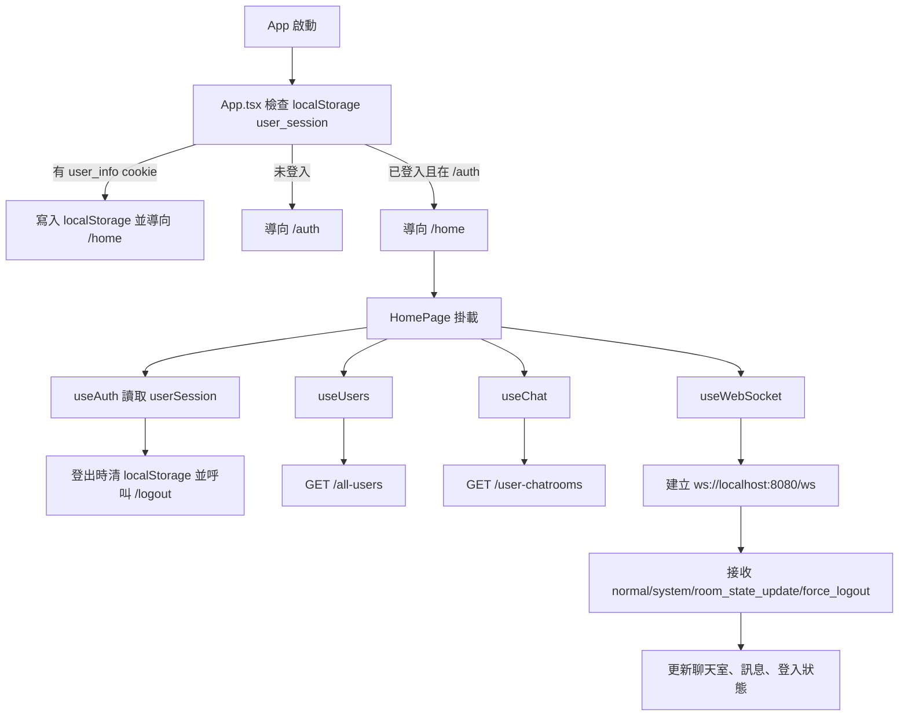

### 觸發條件

- `App.tsx`：
  - 進入頁面時觸發登入導流。
  - 路由變化時重新檢查登入狀態。
  - Google OAuth callback 成功且後端寫入 `user_info` cookie 時，會把 cookie 內容轉存到 `localStorage`。
- `HomePage.tsx`：
  - `userSession` 存在時，自動抓聊天室清單與所有使用者。
  - `userSession` 存在時，自動建立 WebSocket 連線。
- `useWebSocket.ts`：
  - 收到 `force_logout` 時強制執行前端登出。
  - 收到 `room_state_update` 時重新抓聊天室列表。
  - 收到 `normal/system` 時交給 `useChat.updateChatState` 併入訊息狀態。

---

## 3. 認證流程

### 3.1 一般註冊 / 登入

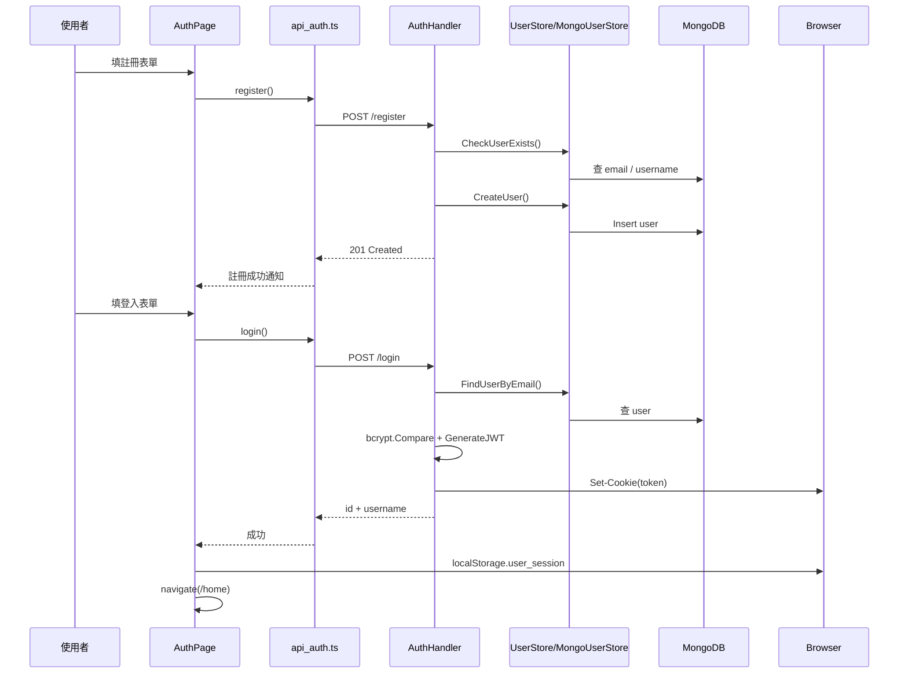

### 3.2 Google OAuth

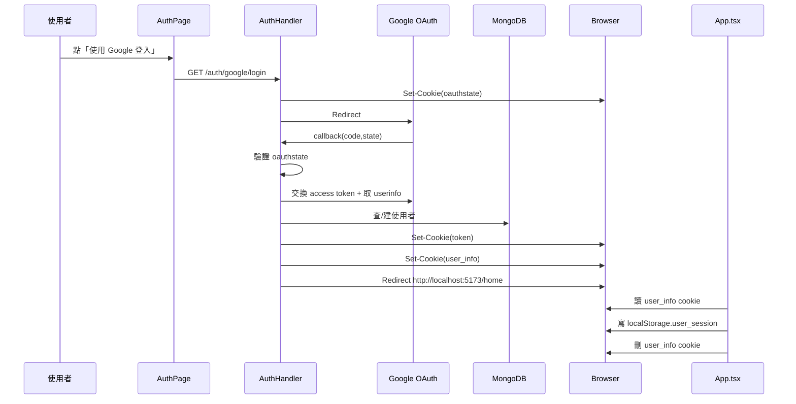

### 認證耦合點

- 前端是否視為「已登入」，看的是 `localStorage.user_session`。
- 後端是否授權 REST / WebSocket，看的是 cookie `token`。
- 這代表登入狀態其實有兩份來源：
  - 前端 UI 狀態：`localStorage`
  - 後端授權狀態：HttpOnly cookie
- 兩者不同步時，可能出現：
  - 前端以為已登入，但 cookie 已失效。
  - WebSocket 或 REST 回 401 後才被動發現。

---

## 4. 首頁初始化與資料載入

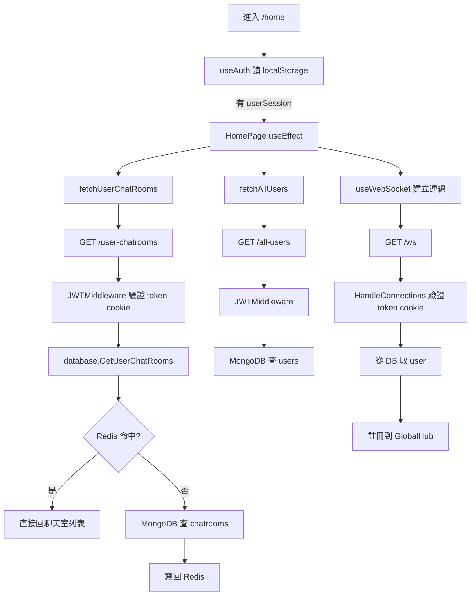

### 觸發條件

- 只有在 `userSession` 存在時才會觸發首頁初始化。
- 聊天室列表是首頁核心依賴，很多功能更新後都會重新抓它。
- 使用者列表與聊天室列表都是經過 JWT middleware 的保護資源。
- WebSocket 不是傳 Authorization header，而是直接依賴瀏覽器攜帶 cookie。

---

## 5. 建立聊天室流程

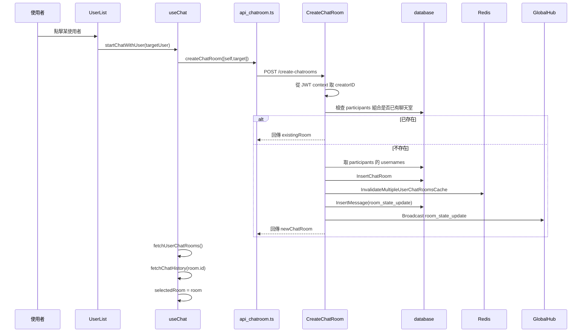

### 觸發條件

- 由首頁左側 `UserList` 點擊其他使用者觸發。
- 即使前端傳入當前使用者 ID，後端仍會自行從 JWT context 補入 creator，避免缺漏。
- 後端會先做「同一組 participant 是否已存在聊天室」查詢，因此這個 API 兼具：
  - 建立聊天室
  - 找回既有聊天室

### 耦合點

- 建立聊天室後不是只回 HTTP response，還會額外：
  - 清 Redis 快取
  - 寫一筆 `room_state_update` 訊息到 MongoDB
  - 送出 WebSocket 廣播
- 這使得 `CreateChatRoom` 同時耦合到：
  - DB 持久化
  - 快取一致性
  - 即時通知

---

## 6. 選聊天室與讀取歷史訊息

```mermaid
flowchart TD
    A[使用者點聊天室] --> B[ChatRoomList.onSelectRoom]
    B --> C[useChat.handleSelectRoom]
    C --> D[selectedRoom = room]
    C --> E[GET /chat-history?roomId=...]
    E --> F[JWTMiddleware]
    F --> G[websocket.HandleChatHistory]
    G --> H[database.GetChatHistory]
    H --> I[MongoDB messages 查詢 + timestamp 升序 + limit 50]
    I --> J[寫入 messages Map<roomId, Message[]>]
```

### 觸發條件

- 只有使用者明確選取某聊天室時，才會抓取該房間歷史訊息。
- 歷史訊息不靠 WebSocket 補，而是透過 REST 單獨查詢。
- 取得歷史訊息後，畫面顯示時會過濾掉 `room_state_update`。

---

## 7. 發送訊息與即時廣播

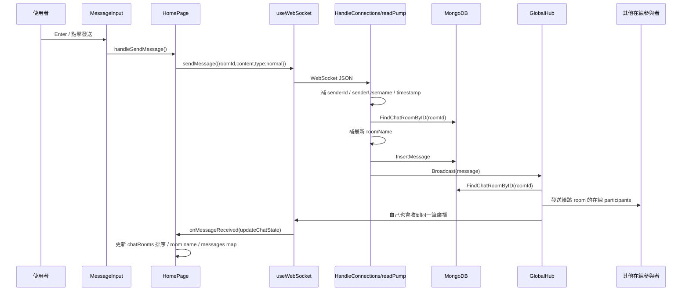

### 觸發條件

- 訊息送出來源有兩種：
  - 按 Enter
  - 點發送按鈕
- `sendMessage` 只在 `isConnected === true` 才會送。
- 後端不信任前端送來的 sender 資訊，會重建：
  - `SenderID`
  - `SenderUsername`
  - `Timestamp`
  - `RoomName`

### 耦合點

- WebSocket 廣播不是維護 room channel，而是收到 message 後「再查一次聊天室參與者」。
- 因此廣播流程耦合到 MongoDB，Hub 並不是完全記憶體內自治。
- 好處是永遠以 DB 的房間成員為準。
- 代價是每次廣播都多一次 `FindChatRoomByID` 查詢。

---

## 8. 邀請新成員進聊天室

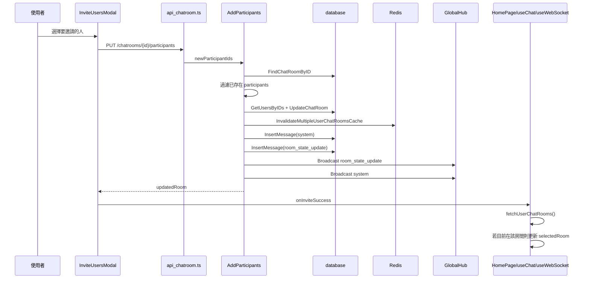

### 觸發條件

- 從 `ChatRoomList` 的選單點「邀請」開 modal。
- modal 只顯示「不在該聊天室中」且符合搜尋條件的使用者。
- 如果實際上沒有新成員可加入，後端會直接回成功但不做更新。

### 耦合點

- 邀請功能非常重：
  - 改聊天室 participants
  - 重新計算聊天室名稱
  - 清除全部成員聊天室快取
  - 產生系統訊息
  - 產生隱藏更新訊息
  - 經 WebSocket 通知舊成員與新成員
- 這是整個專案耦合最高的單點之一。

---

## 9. 退出聊天室

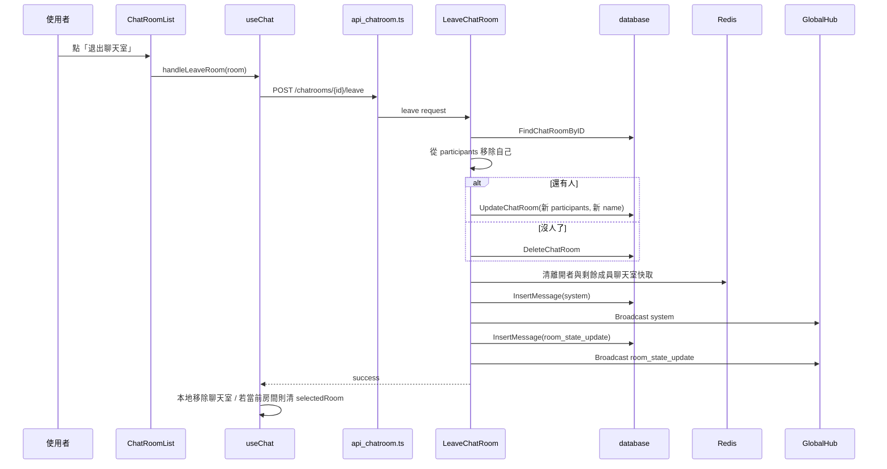

### 觸發條件

- 從聊天室右側選單點擊退出。
- 如果退出後聊天室無人，聊天室會被刪除。
- 如果還有人，聊天室名稱會依剩餘成員重新命名。

### 耦合點

- 和邀請一樣，同步牽動 DB、Redis、訊息系統、WebSocket。
- `LeaveChatRoom` 還依賴 `GetUserByID` 來產生「某人已離開聊天室」文案。

---

## 10. WebSocket 連線與強制登出

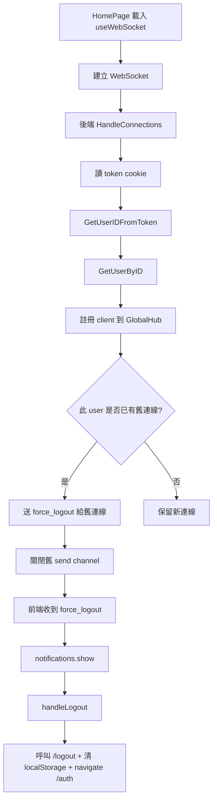

### 觸發條件

- 同一帳號在另一台裝置或另一個分頁重新建立 WebSocket 時。
- Hub 會保留新連線、踢掉舊連線。

### 耦合點

- 強制登出不是靠 JWT blacklisting，而是靠 WebSocket single-session 策略。
- 前端接到 `force_logout` 後，才真正清掉本地登入狀態。

---

## 11. 後端模組耦合地圖

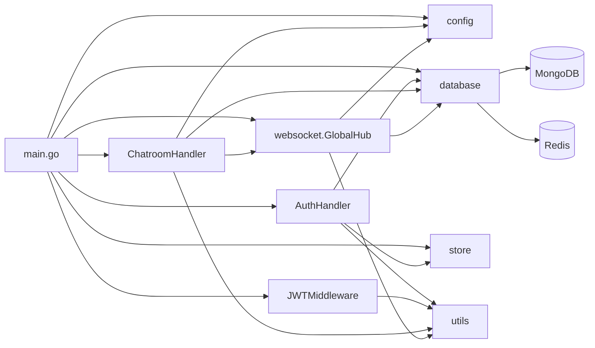

### 耦合強度

| 模組 | 依賴對象 | 耦合強度 | 原因 |
|---|---|---:|---|
| `HomePage` | `useAuth/useUsers/useChat/useWebSocket` | 高 | 首頁是前端編排中心 |
| `useChat` | REST API + UI state + WebSocket callback | 高 | 管理聊天室、訊息、排序、選中狀態 |
| `useWebSocket` | 認證狀態、通知、聊天室刷新、訊息合併 | 高 | 負責把 server event 接回前端狀態 |
| `CreateChatRoom` | DB + Redis + WebSocket | 高 | 一次操作影響三層 |
| `AddParticipants` | DB + Redis + WebSocket + user lookup | 很高 | 修改資料、名稱、系統通知、同步 |
| `LeaveChatRoom` | DB + Redis + WebSocket + user lookup | 很高 | 邏輯分支多，跨資源更新 |
| `GlobalHub.Broadcast` | MongoDB 房間資料 | 中高 | 每次廣播都要查 room participants |
| `AuthHandler` | UserStore + JWT utils + Cookie | 中 | 認證流程集中但邊界清楚 |
| `JWTMiddleware` | token cookie + utils | 低 | 功能單純 |
| `MongoUserStore` | MongoDB collection | 低 | 是清楚的資料存取抽象 |

---

## 12. 功能觸發總表

| 功能 | 觸發來源 | 前端入口 | 後端入口 | 額外副作用 |
|---|---|---|---|---|
| 註冊 | 使用者送出註冊表單 | `AuthPage.handleRegister` | `POST /register` | 寫入 user |
| 登入 | 使用者送出登入表單 | `AuthPage.handleLogin` | `POST /login` | cookie `token` + localStorage session |
| Google 登入 | 點 Google 按鈕 | `AuthPage.handleGoogleLogin` | `/auth/google/login` + callback | `token` + `user_info` cookie |
| 首頁初始化 | `userSession` 存在 | `HomePage useEffect` | `/user-chatrooms`, `/all-users`, `/ws` | 載入聊天室、使用者、即時連線 |
| 建立/找回聊天室 | 點某使用者 | `useChat.startChatWithUser` | `POST /create-chatrooms` | 清快取、寫更新訊息、WS 廣播 |
| 選聊天室 | 點聊天室清單 | `useChat.handleSelectRoom` | `GET /chat-history` | 讀取最近 50 筆 |
| 發訊息 | Enter / 點發送 | `HomePage.handleSendMessage` | WebSocket message | 寫 MongoDB、廣播 |
| 邀請成員 | modal 送出 | `InviteUsersModal.handleInvite` | `PUT /chatrooms/{id}/participants` | 更新 room、清快取、寫兩類系統訊息、WS 廣播 |
| 退出聊天室 | 點退出 | `useChat.handleLeaveRoom` | `POST /chatrooms/{id}/leave` | 更新或刪除 room、清快取、寫兩類系統訊息、WS 廣播 |
| 強制登出 | 同帳號新連線註冊 | `useWebSocket.onmessage` | `GlobalHub.register` | 舊連線被踢出 |

---

## 13. 最值得注意的隱性耦合

### A. 認證狀態分裂

- 前端靠 `localStorage.user_session` 判斷是否登入。
- 後端靠 cookie `token` 驗證授權。
- 如果只有其中一份存在，UI 與 API 行為會不一致。

### B. 聊天室名稱是衍生資料

- 房間名稱不是獨立維護，而是由 participants 的 usernames 重新組裝。
- 因此只要 participants 改變，聊天室名稱也會一起變。
- 影響路徑：
  - 邀請成員
  - 離開聊天室
  - 建立聊天室

### C. WebSocket 並不直接持有房間成員狀態

- 廣播時會去查 DB。
- 這讓 WebSocket 依賴資料庫可用性與查詢效能。

### D. `room_state_update` 是重要但隱藏的同步事件

- 前端 UI 不顯示它。
- 但前端狀態同步很依賴它。
- 用途包括：
  - 重新抓聊天室列表
  - 更新聊天室名稱
  - 讓新增 / 退出成員能同步看到最新 room state

### E. Redis 只快取聊天室列表，不快取訊息

- `GET /user-chatrooms` 可能走 Redis。
- `GET /chat-history` 一定走 MongoDB。
- 訊息同步主要靠 WebSocket 即時推送。

---

## 14. 你可以怎麼閱讀這個專案

如果你想最快抓到主幹，建議順序如下：

1. `backend/main.go`
2. `frontend/src/App.tsx`
3. `frontend/src/pages/HomePage.tsx`
4. `frontend/src/hooks/useChat.ts`
5. `frontend/src/hooks/useWebSocket.ts`
6. `backend/handlers/chatroom_handler.go`
7. `backend/websocket/websocket.go`
8. `backend/database/mongodb.go`

---

## 15. 一句話總結

這個專案的本質是：

`Auth + Chatroom REST 管理 + WebSocket 即時同步 + MongoDB 持久化 + Redis 聊天室列表快取`

其中最核心的耦合中心有兩個：

- 前端：`HomePage + useChat + useWebSocket`
- 後端：`chatroom_handler + websocket.GlobalHub + database`
